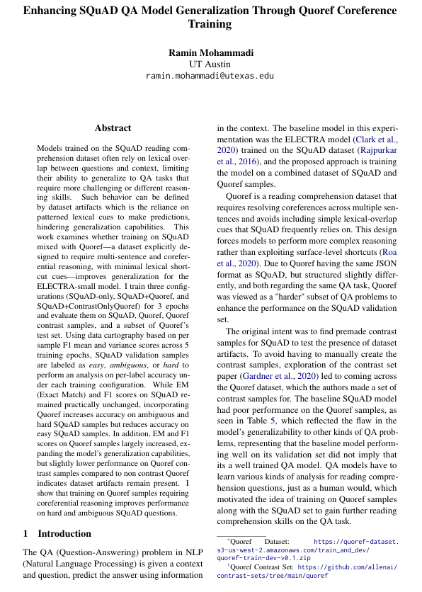

# Enhancing ELECTRA Performance on Hard and Ambiguous SQuAD Questions
- Demonstrated that training with Quoref samples—which emphasize coreferential reasoning and minimize lexical 
shortcuts—improves performance on hard and ambiguous SQuAD questions 
- Applied data cartography to the SQuAD validation dataset using per-sample F1 mean and variance across 5 training 
epochs, labeling samples as easy, hard, or ambiguous 
- Enhanced ELECTRA-small exact-match accuracy on the SQuAD validation set by +5% on hard questions and +1% on 
ambiguous questions, with a −1% decrease on easy questions

